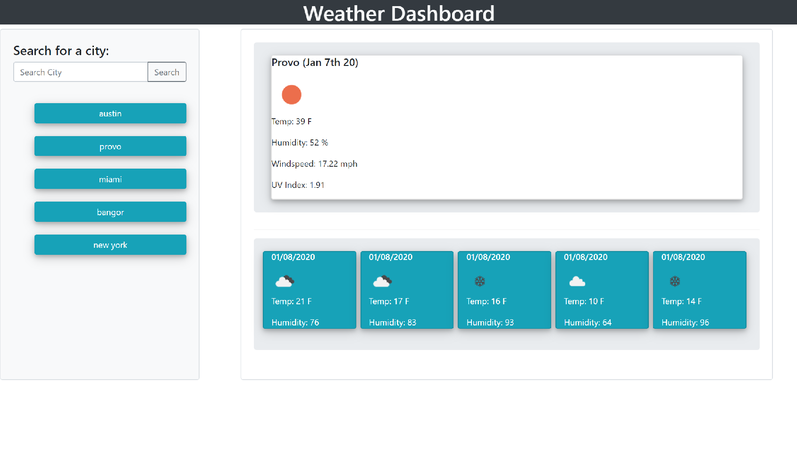
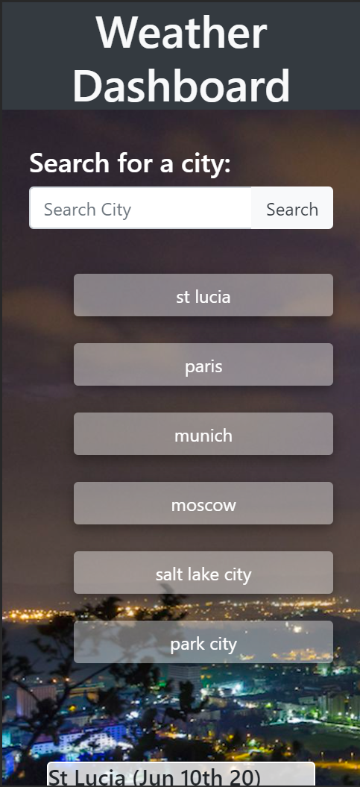
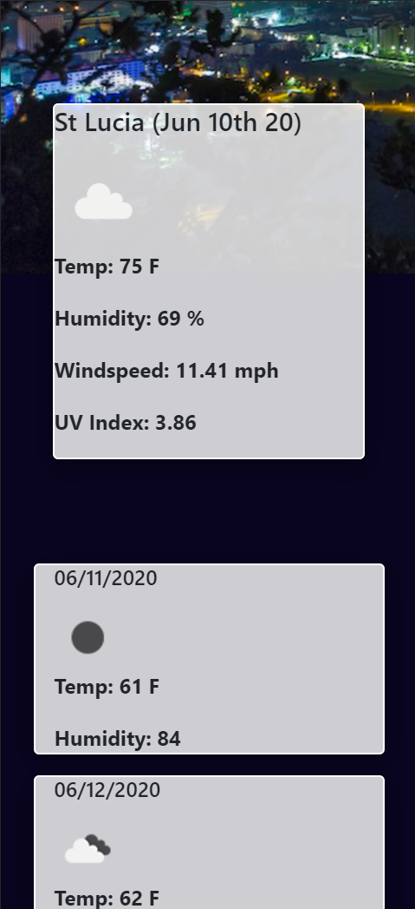

# Project Title
​
## Overview
​
This application allows you to type in a city name and see the the current temperature, humidity, uv index and windspeed as well as for the next 5 days. It will also keep a record of the 5 most recent city searches as buttons. The user may click on those buttons to get the current and 5 day weather forecast for each of those citys.
​
### Gallery
​
#### Desktop:

​
#### Mobile:

​
​
​
## Tech and Features Used
​
* Bootstrap
* Javascript
* JQuery
* Open Weather API
* Postman

​
## How to use
​
Type in a cities name in the search bar and click search. on the right side of the screen you will see the current weather on a large card. underneath that card you will see the five day forecast.
After you click search, a button will appear on the left side of the screen underneath the search bar with the name of the city that you just searched for.
When you click on that button the right side of the screen will populate the weather information for that city.
When you search for a new city the search button will generate a new history button underneath the search bar, and the old search button will move down a level. Everytime you search for a new city the same process will take place until you have reached five cities and then the oldest city button will dissapear.
​
## Technical Overview
​
1. The search button triggers the ajax call to the open weather current weather api, the uv index api, the five day forecast weather api, and saves the city name to a variable,saves the city name to an array in local storage and if there is any information populated on any of the weather cards it clears that information.
2. The openweather api will send back the weather information including the latitude and longitude for the city we are searching for.
3. The uv index api is going to use the latitude and longitude information from the current weather api to give us the uv index.
4. the city name variable is going to be used in the ajax call for the 5 day forecast api.
5. the city name will be saved in local storage.
6. there is a function that is called before the ajax calls that takes the saved information from local storage and loops through the city list array and creates a list of buttons with the name of the city on each button.
7. the button will go through the same process of the seach button with the exception of saving the city name to the local storage array, and therefore does not create a new city button under the search bar.
8. As the API calls finish the information needed (temperature, humidity, uv index and windspeed) populate the current weather card, as well as the five day forecast cards.

## Challenges

Some of the challenges I faced:

- the JQuery click method did not like working on dynamically created classes, I learned that click methods need to be grabbed from the static parent of the created buttons. with the syntax being $("#city-list").on("click", "button",function()) with the selector being city-list, then the event handler, then the event selector being button.

- the other challenge i had were the ajax calls being synchronous and how or if I could wait for the information i was getting would affect the next multiple ajax calls. The uv index call required lon and lat information which came from the current weather api. so I nested the uv index ajax call in the current weather call.
- the five day forecast also needed the city ID code, if I wanted to make sure that the same city that was being called from the current weather api, so I nested that in the .then method after the ajax call as well so to wait for the information to get back. ultimately i did not have to do any async manipulation with this app.
​
Link to example readme:
​
https://github.com/jacobdolph/06-weather-dashboard-homework
https://jacobdolph.github.io/06-weather-dashboard-homework/